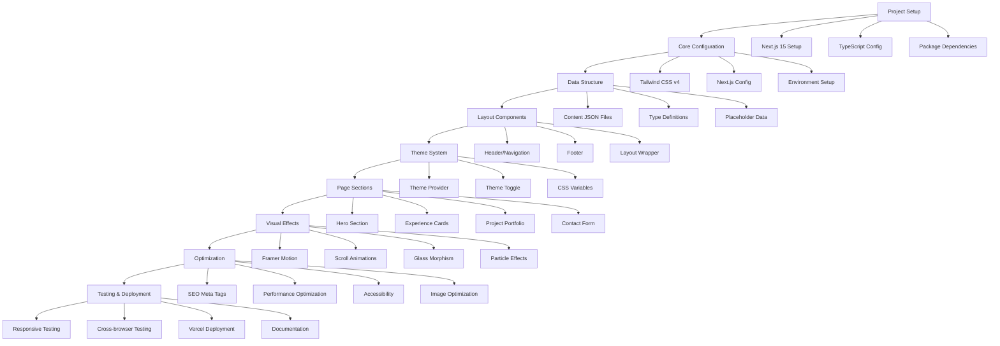
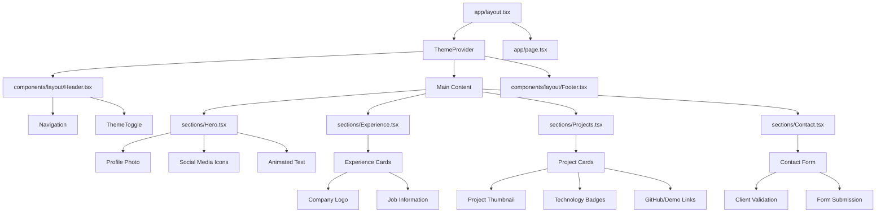
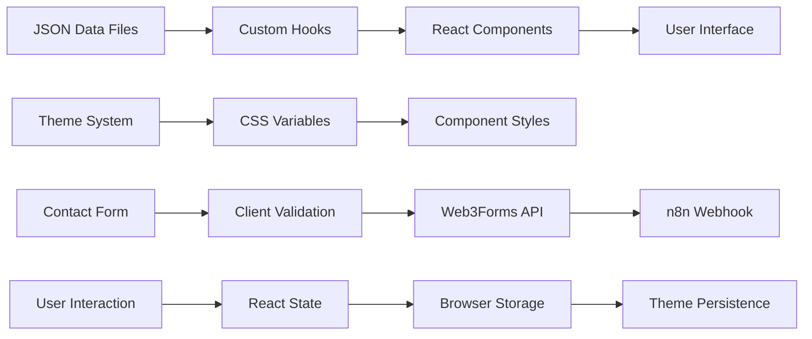
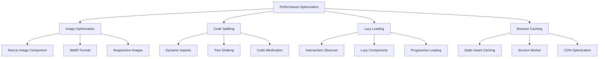
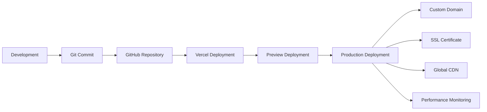
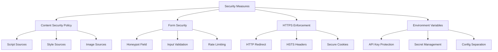

# Implementation Workflow

## Development Phases

## Component Hierarchy

## Data Flow Architecture

## Performance Optimization Strategy

## Deployment Pipeline

## Security Implementation

## Testing Strategy

```mermaid
graph TD
    Testing[Testing Strategy] --> Unit[Unit Tests]
    Testing --> Integration[Integration Tests]
    Testing --> E2E[End-to-End Tests]
    Testing --> Performance[Performance Tests]
    Testing --> Accessibility[Accessibility Tests]
    
    Unit --> Components[Component Testing]
    Unit --> Utils[Utility Functions]
    Unit --> Hooks[Custom Hooks]
    
    Integration --> FormSubmission[Form Submission]
    Integration --> ThemeToggle[Theme Switching]
    Integration --> Navigation[Navigation Flow]
    
    E2E --> UserJourney[User Journey]
    E2E --> CrossBrowser[Cross-browser Testing]
    E2E --> ResponsiveDesign[Responsive Design]
    
    Performance --> Lighthouse[Lighthouse Audits]
    Performance --> WebVitals[Core Web Vitals]
    Performance --> LoadTesting[Load Testing]
    
    Accessibility --> ScreenReader[Screen Reader Testing]
    Accessibility --> KeyboardNav[Keyboard Navigation]
    Accessibility --> ColorContrast[Color Contrast]
```

## Development Timeline

| Phase | Duration | Tasks | Deliverables |
|-------|----------|-------|--------------|
| **Setup** | 1-2 hours | Project initialization, dependencies, configuration | Working Next.js app with Tailwind |
| **Core Structure** | 2-3 hours | Layout components, theme system, data structure | Basic layout with theme toggle |
| **Content Sections** | 4-5 hours | Hero, Experience, Projects, Contact sections | Complete page sections |
| **Visual Effects** | 2-3 hours | Animations, glass morphism, particle effects | Atmospheric visual design |
| **Optimization** | 2-3 hours | SEO, performance, accessibility, responsive design | Production-ready optimization |
| **Testing & Deploy** | 1-2 hours | Testing, documentation, Vercel deployment | Live website |

**Total Estimated Time: 12-18 hours**

## Quality Assurance Checklist

### Functionality
- [ ] Theme toggle works across all sections
- [ ] Contact form submits successfully
- [ ] All navigation links work smoothly
- [ ] Social media links open correctly
- [ ] Responsive design on all devices
- [ ] Cross-browser compatibility

### Performance
- [ ] Lighthouse score >90 (all metrics)
- [ ] First Contentful Paint <1.5s
- [ ] Largest Contentful Paint <2.5s
- [ ] Cumulative Layout Shift <0.1
- [ ] Images optimized and lazy loaded
- [ ] Bundle size <200KB

### Accessibility
- [ ] WCAG 2.1 AA compliance
- [ ] Keyboard navigation works
- [ ] Screen reader compatibility
- [ ] Color contrast >4.5:1
- [ ] Alt text for all images
- [ ] Proper heading hierarchy

### SEO
- [ ] Meta tags implemented
- [ ] Open Graph tags
- [ ] Twitter Card tags
- [ ] Sitemap generated
- [ ] Robots.txt configured
- [ ] Structured data markup

This workflow ensures systematic development with clear milestones and quality gates at each phase.